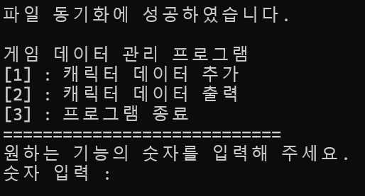

# Game-Character-Information-Management-Program
---
게임 캐릭터 관리 프로그램입니다.

C언어 공부 이후 깃허브 학습을 위해 만들었습니다.

부족한 부분이 많지만 발전해나가겠습니다.

It is a game character management program.

I made it for GitHub learning after studying C language.

There are many shortcomings, but we will continue to develop

---
실행 화면 / Run screen

---
+ 포인터 / Pointer
  
+ 동적 메모리 할당 / Dynamic Memory Allocation
  
+ 파일 입출력 / File Input/Output
  
세 가지를 중점으로 공부하였습니다.

I focused on three things

---
Version 1 (25/04/16) Updata

---
